# 硬件准备

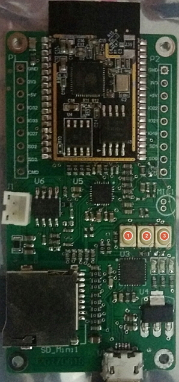

首先准备好rt-iot audio开发板  
用micro USB接头的USB线连接电脑  
此时最左边的LED灯亮，表明工作正常，否则请检查USB连线及电路板硬件。

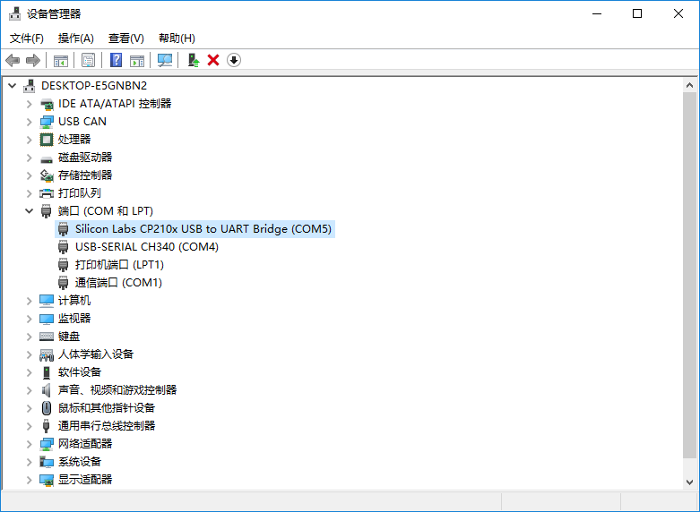
rt-iot audio内置USB转串口芯片CP2102，打开设备管理器，可以看到开发板的串口号（此处为COM5），记住串口号，后面烧录的时候要用到。

# 软件准备

## 下载源代码

rt-iot audio的源代码存放在[https://github.com/BernardXiong/rtthread-esp][72274f67]  

为了下载源代码我们首先要安装 [git][a9c9fba0]  

  

然后可以再装个git的客户端

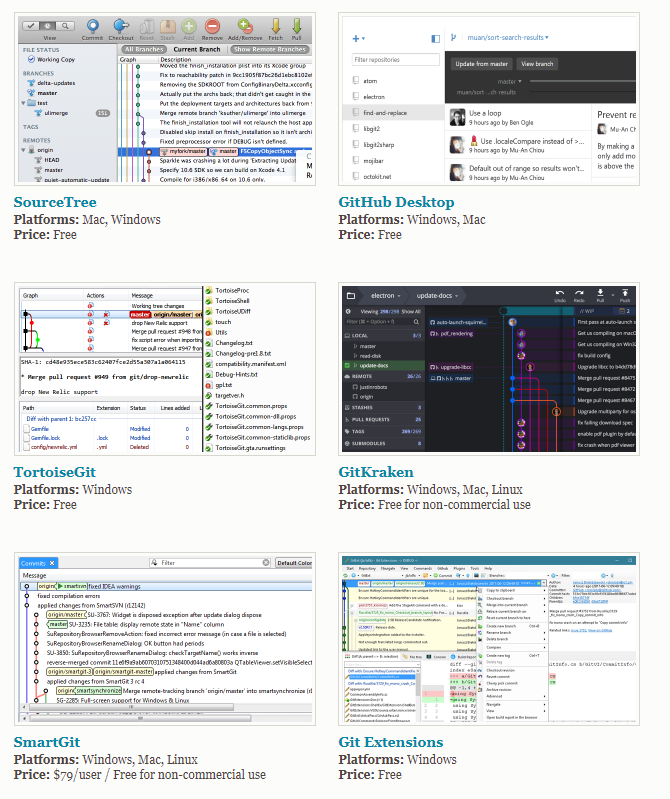

例如SourceTree、TotoiseGit、SmartGit等，也可以不装，下面例子中没有用到。  

根据 https://github.com/BernardXiong/rtthread-esp 中README.md中的说明，用git克隆源代码。

在资源管理器中右键选择Git Bash Here(安装过git后就会出现)

完成后

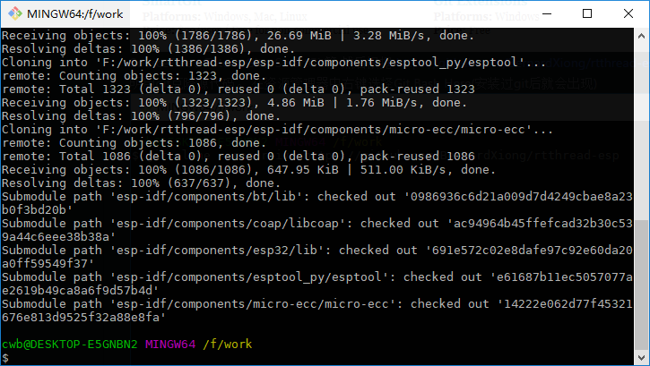

可以看到源码目录  

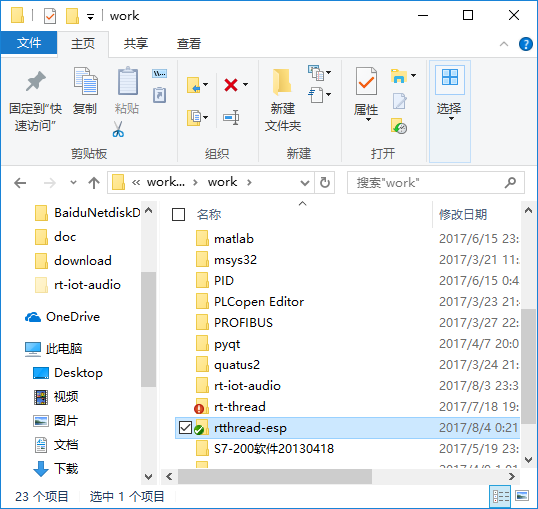

## 安装编译器

源代码下载好了，下面就要编译了，首先要下载编译工具，根据README.md中的说明，下载对应的版本，Windows下为
https://dl.espressif.com/dl/xtensa-esp32-elf-win32-1.22.0-59.zip

下载后解压到msys32目录下

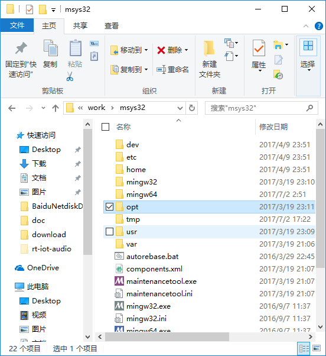  

编译工具在msys32\opt\xtensa-esp32-elf目录下

## 安装编译工具

rt-thread编译需要用到scons和python，首先安装python，https://www.python.org/downloads/ 我们需要安装2.7.x版本。  

安装完成后要在系统环境变量里加入Python27和Python27\Scripts，如下

  

下载 scons http://scons.org/pages/download.html 然后安装,安装完成后在命令行里输入scons，没有提示找不到命令，表明安装正确

esp32的烧录需要pyserial，可以通过命令行 `pip install pyserial`进行安装

## 安装配置工具

rt-thread可以通过menuconfig进行配置，我们需要安装它的运行环境env-20170625.zip，这个在RT-Thread/ESP32的QQ群的群文件里可以下载。

下载后解压到env目录

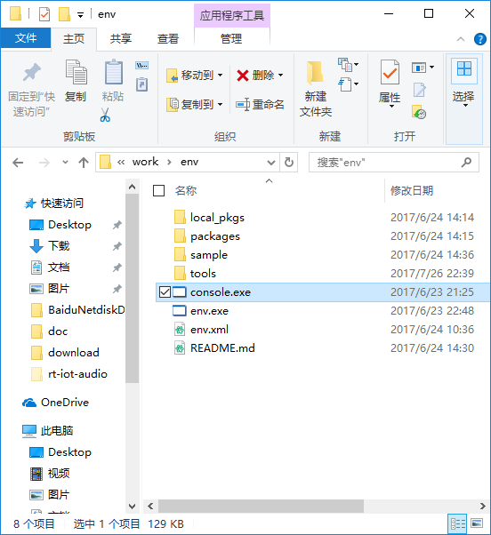  

将msys32\opt\xtensa-esp32-elf整个目录复制到env\tools目录下并重命名为gnu_gcc(我也不知道有什么用)  

打开console.exe，进入源代码目录rtthread-esp,运行menuconfig命令

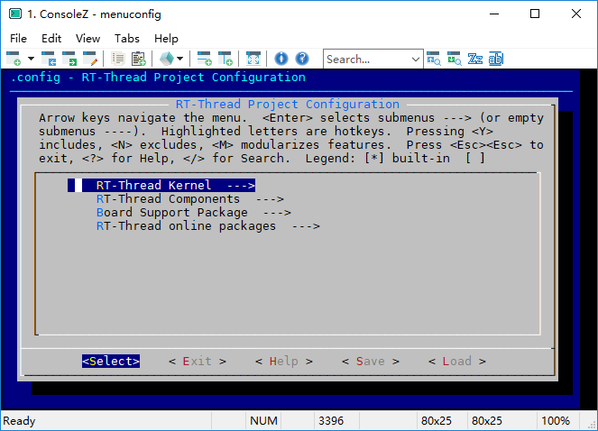  

可以按需要进行配置  

# 编译

将rtconfig.py中的EXEC_PATH改为编译器的目录

  

运行scons命令进行编译  

  

编译完成  

  

运行mkbin.bat生成bin文件

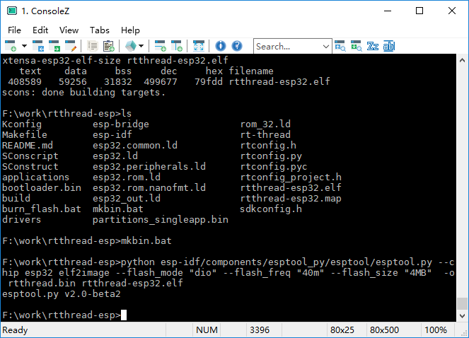  

下面要进行烧录，首先要改一下串口号

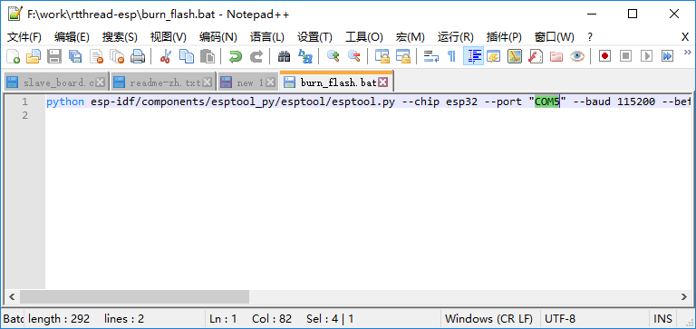  

按住开发板右边的两个按键（即最开始图中的2和3键），然后按一下左边按键并松开，松开右边两个按键。  

最左边的按键是复位按钮，按下复位后进入烧录模式。  

运行burn_flash.bat

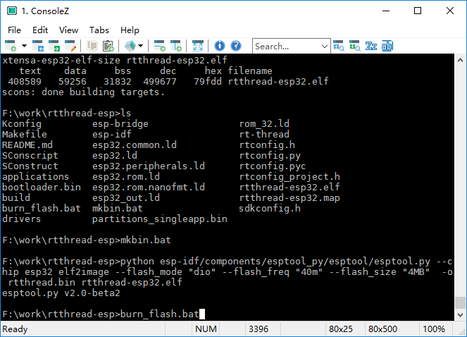  

烧录中  

  

烧录完成  

然后用终端连接ESP32，这里我用的Xshell

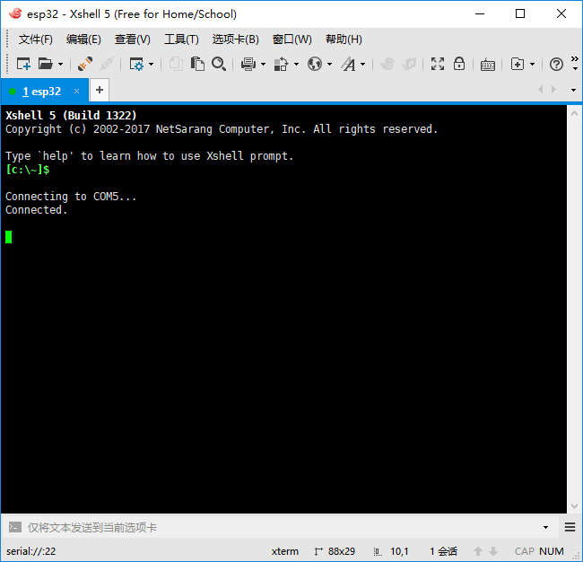  

按下开发板最左边的复位按钮

  

看到RT-Thread的logo表明烧录成功

# 配网

开发板默认如果没有找到WIFI配置就开始airkiss配网

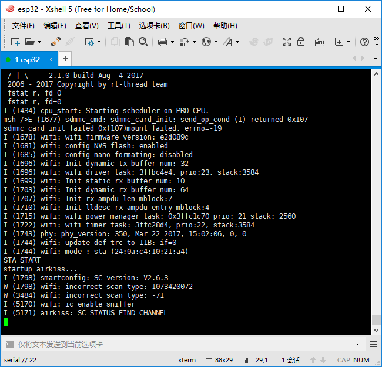  

airkiss可以使用微信进行配置，也可以用airkiss调试工具http://iot.weixin.qq.com/wiki/document-0_6.html  

这里我们使用微信，查找安信可的公众号

   

开始WIFI配置

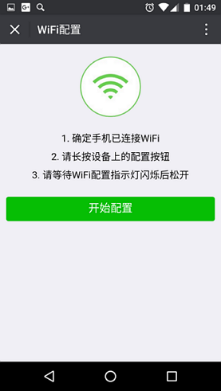

输入目前手机连接的WIFI的密码

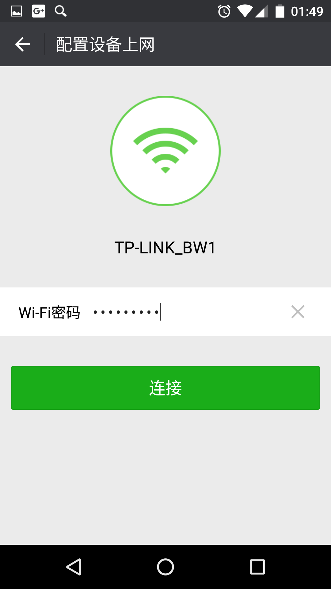

连接成功

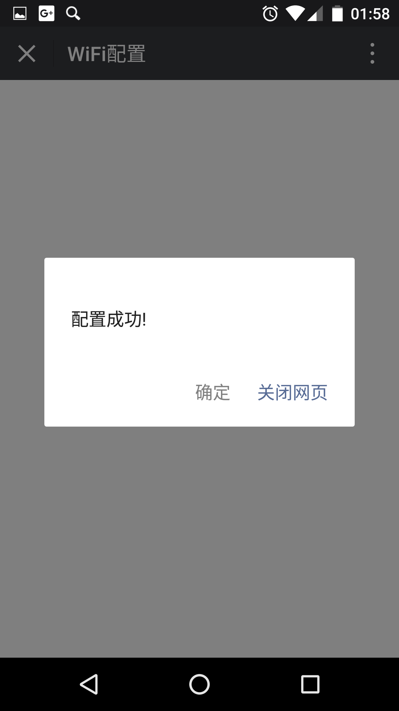

此时终端显示  

  

查看IP地址  

  

ping开发板  

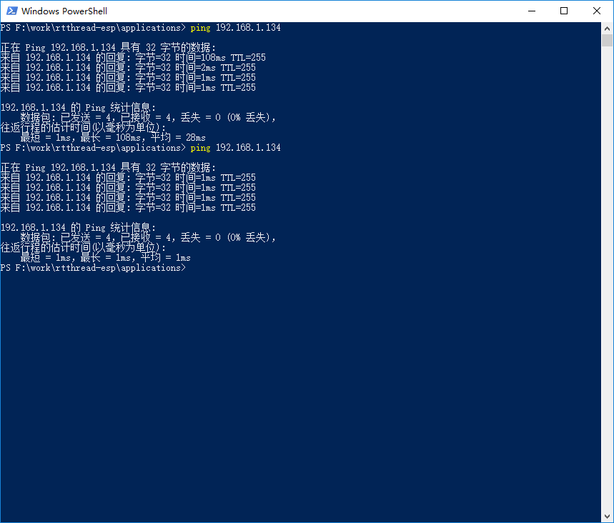

配网成功。

[72274f67]: https://github.com/BernardXiong/rtthread-esp-idf "rt-iot audio源代码"
[a9c9fba0]: https://git-scm.com/downloads "git"
