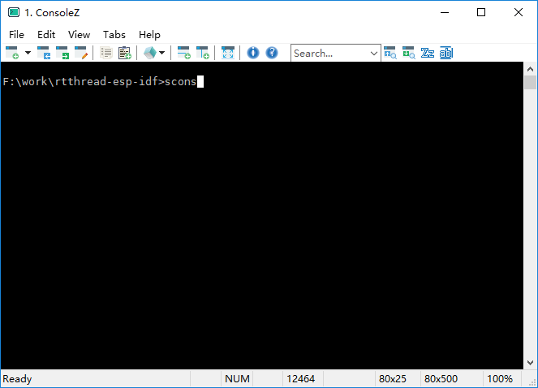

# 1. 硬件准备
首先准备好rt-iot audio开发板  


* 用micro USB接头的USB线连接电脑  
此时最左边的LED灯亮，表明工作正常，否则请检查USB连线及电路板硬件。


* rt-iot audio内置USB转串口芯片CP2102，打开设备管理器，可以看到开发板的串口号（此处为COM5），记住此串口号，后面烧录的时候要用到。

# 2. 软件准备

## 2.1 准备源代码

rt-iot audio的源代码存放在[https://github.com/BernardXiong/rtthread-esp-idf][72274f67]  

### 2.1.1 为了下载源代码我们首先要安装 [git][a9c9fba0]  

  

然后可以再装个git的图形界面客户端,使用起来更方便。


例如SourceTree、TotoiseGit、SmartGit等，也可以不装，下面例子中没有用到。  

### 2.1.2 克隆源代码
根据 [https://github.com/BernardXiong/rtthread-esp-idf][72274f67] 中README.md中的说明，用git克隆源代码。

在资源管理器中右键选择Git Bash Here(安装过git后就会出现)


完成后


可以看到源码目录  


### 2.1.3 更新子模块并打补丁
在使用git之前要配置用户名和邮箱，命令行运行命令如下，注意改为自己的名字和邮箱。
```sh
git config --global user.name "My Name"
git config --global user.email myEmail@example.com
```
按照 [https://github.com/BernardXiong/rtthread-esp-idf][72274f67] 中README.md中的说明，在命令行窗口中继续执行以下命令：
```sh
cd rtthread-esp-idf
git submodule init
git submodule update

cd esp-idf-port/esp-idf
git submodule init
git submodule update

git am ../0001-cpu_start-patch.patch
git am ../0002-add-esp_task.h.patch
git am ../0003-add-memset-to-0.patch
```
请注意在正确的目录下执行以上命令，并且按照顺序执行。
## 2.2 安装编译工具

源代码准备好了，下面就要编译了.
 * 首先要下载编译工具，根据README.md中的说明，下载对应的版本。  
 Windows下可以到 http://esp-idf.readthedocs.io/en/latest/get-started/windows-setup-scratch.html# 最下方找到最新版的编译工具，目前最新版为 https://dl.espressif.com/dl/xtensa-esp32-elf-win32-1.22.0-61-gab8375a-5.2.0.zip

 * 下载编译环境env，可以在RT-Thread/ESP32的QQ群的群文件里可以下载env-2017xxxx.zip，使用env比手动配置工具更加方便:
    * 可以通过menuconfig配置rt-thread
    * 自带配置好的Python和scons
    * 自动配置编译器的路径

下载后解压env-2017xxxx.zip到env目录

  

* 将xtensa-esp32-elf-win32-xxx.zip解压
* 将xtensa-esp32-elf整个目录复制到`env\tools`目录下
* 重命名为gnu_gcc

  

# 3. 配置、编译、烧录
## 3.1 配置
* 打开console.exe
* 进入源代码根目录rtthread-esp-idf
* 运行menuconfig命令

然后按需要进行配置,初次使用可以保持默认配置。

  

更改`applications\main.c`文件


将WIFI_SSID和WIFI_PASSWD改为自己的WIFI名称和密码。

## 3.2 编译

* 打开env目录下的console.exe
* 使用cd命令进入源代码目录rtthread-esp-idf
* 运行`scons`命令进行编译  



编译完成后运行`mkbin.bat`生成rtthread.bin文件


## 3.3 烧录

### 3.3.1 烧录配置
烧录前首先要改一下串口号。  
打开源代码根目录下的`burn_flash.bat`，将端口号改为文章开头所述开发板的端口号。

  

### 3.3.2 烧录
* 按住开发板右边的两个按键（即最开始图中的2和3键）
* 然后按一下最左边按键并松开(最左边的按键是复位按钮，按下复位后进入烧录模式)
* 松开右边两个按键
* 运行`burn_flash.bat`

  

烧录中  

  

烧录完成  


# 4. 测试

## 4.1 连接
用终端连接ESP32，这里我用的Xshell，也可以用putty，串口助手等。

  

按下开发板最左边的复位按钮


## 4.2 查看IP地址
* 按下回车键，进入开发板命令行，按TAB键可显示可用的命令。
* 输入 `ifconfig` 查看开发板的ip地址。

  

## 4.3 ping 开发板


# 5. It works

* 以上就是rt-iot audio开发板的基本使用，接下来就可以编写程序实现自己想要的功能了。

* 另外，代码中实现了airkiss功能，应用可以参考https://github.com/BernardXiong/rtthread-esp/blob/master/applications/main.c。
注意，不是rtthread-esp-idf。airkiss配置可以使用“安信可科技”的微信公众号进行配置。  
.

全文完。


[72274f67]: https://github.com/BernardXiong/rtthread-esp-idf "rt-iot audio源代码"
[a9c9fba0]: https://git-scm.com/downloads "git"
